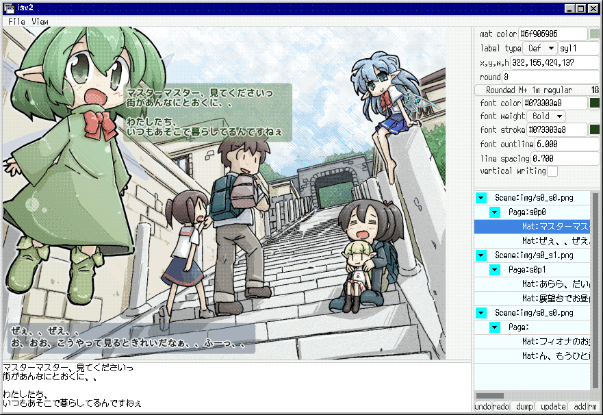

# 概要

**isv2**は，image-with-scenario viewer 2の略です．

このソフトウェアは，テキストつきイラスト集の閲覧および編集のために作成されました．

**NOTE:** これは実験的なソフトです．まだ十分にテストされていません．  
また，データ構造などは今後修正する可能性があります．

# スクリーンショット

# データ構造

* **scene** 同じ画像を持つpage/pmatのまとまり
    * **page** クリック単位(export時に，以下のmat/pmatをまとめて1枚の画像となる)
        * **mat** 1つのセリフとその背景(mat)
        * **ovimg** 将来拡張用，立ち絵や吹き出しなど，pageに追加する画像の配置
    * **pmat** matを一つしか持たないpage
* **group** sceneをまとめて管理するためのノード

# ショートカットキー

| キー | 操作 | 備考 |
| :--- | :--- | :--- |
| Ctrl+] | ページノードを閉じる   |   |
| Ctrl+n | 次のページを選択する   |   |
| Ctrl+p | 前のページを選択する   |   |
| Ctrl+b | 背景の表示をトグルする | テキストの編集に集中したい場合に有効  |

# ツリービューのドラッグ＆ドロップ

Please see [reorderable_list_with_gtk4](https://github.com/kam1610/reorderable_list_with_gtk4).

## Expanderへのドロップ

ノードがExpanderの上半分へドロップされた場合，その親と同じ階層の次ノードになります．
下半分の場合，ドロップ先と同じ階層の次ノードになります．

## Labelへのドロップ

ノードがラベルの上半分へドロップされた場合，ドロップ先を次ノードとする位置に移動します．
下半分の場合，ドロップ先の子(一つ下の階層)ノードになります．

# パラメータ

パラメータ編集用のインタフェースは未作成です．
もし出力解像度を変更する場合はjsonファイルを直接編集してください．

# JSONファイルを直接編集する際のガイド

T.B.W.

# デモ

T.B.W.

# おねがい

このソフトを使用した作品をデジタル作品通販サイトや作家支援サイトで販売，公開される場合，
もし可能であれば，本ソフトを使用した旨を記載いただけると嬉しいです．
(報告の必要はありません．)

# LICENSE

This software is released under BSD 2-Clause License.
Please see LICENSE.

# 謝辞

以下のサイトがとても参考になりました．どうもありがとうございます．

* https://gihyo.jp/article/2023/07/rust-monthly-topics-04-03
* https://gtk-rs.org/gtk4-rs/stable/latest/book/

---

# Summary

**isv2** is image-with-scenario viewer 2.

This software is designed to assist users 
in not only viewing illustrations
but also creating illustration collections that include scenario text.

**NOTE:** This is an experimental work and has not been fully tested yet.
Data structures and other aspects are subject to change.

# Screen shot

# Data structure

* **scene** a collection of pages/pmats which has the same image
    * **page** a unit of click(when exported, the following mat/pmat will be compined into one image)
        * **mat** one text unit and its background
        * **ovimg** for future improvement (e.g., character portrait, speech baloon, ...)
    * **pmat** a page with only one mat
* **group** grouping of scenes

# Shortcut keys

| key    | action               | remark |
| :---   | :---                 | :--- |
| Ctrl+] | Collapse all pages   |                                                     |
| Ctrl+n | Select next page     |                                                     |
| Ctrl+p | Select previous page |                                                     |
| Ctrl+b | Toggle bgimg         | Useful when you want to concentrate on editing text |

# Drag and drop on tree view

Please see [reorderable_list_with_gtk4](https://github.com/kam1610/reorderable_list_with_gtk4).

## Drag from a node to an expander

When the node is dropped on the top half of the expander, the node becomes a parent with that expander's node as a neighbor.
On the other hand, on the lower half, the node becomes a neighbor of the expander's node.

## Drag from a node to a label

When the node is dropped on the top half of the label, the node becomes a parent with that label's node as a neighbor.
On the other hand, on the lower half, the node becomes a child of the label's node.

# Parameter

The interface to edit parameters is not yet available. 
When changing the export resolution, please edit the JSON file directly.

# Guide to editing json directry

T.B.W.

# Demo

T.B.W.

# Appreciate for your help

When you create an image collection and sell or publish it on a
digital content market or creator support site, 
we would appreciate it if you could indicate that you used this software.
(There is no need to report.)

# LICENSE

This software is released under BSD 2-Clause License.
Please see [LICENSE](LICENSE).

# Acknowledge

The site below are very helpful.

* https://gihyo.jp/article/2023/07/rust-monthly-topics-04-03
* https://gtk-rs.org/gtk4-rs/stable/latest/book/

